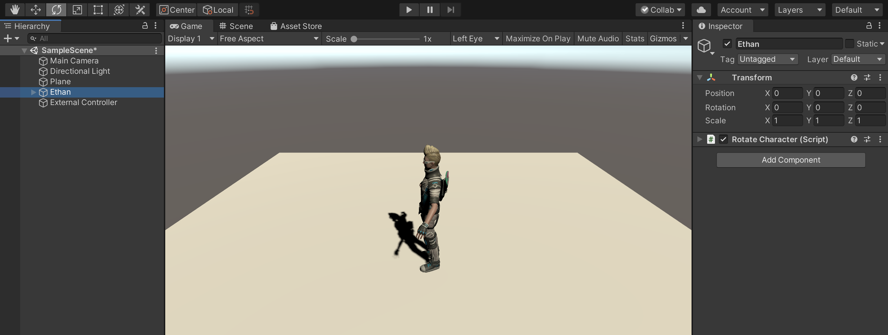
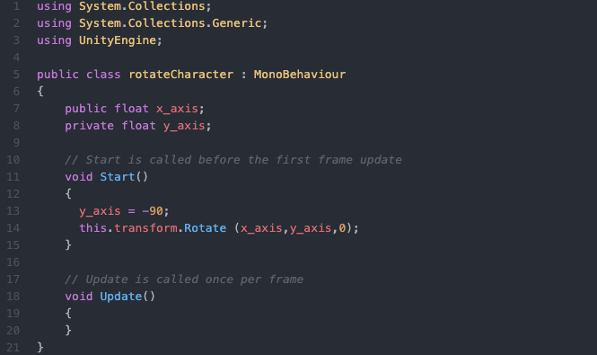
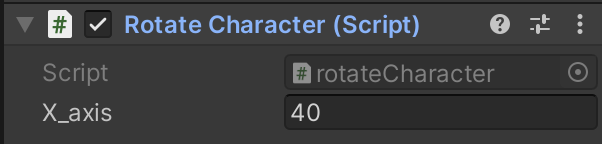
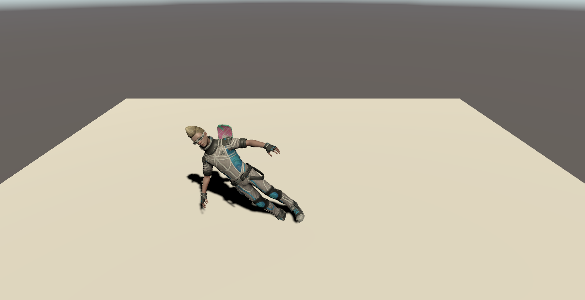
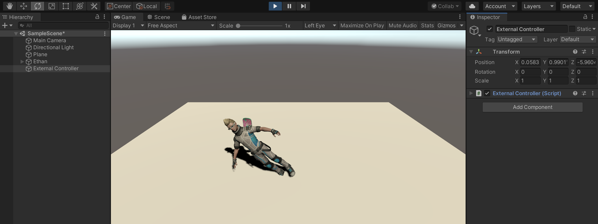
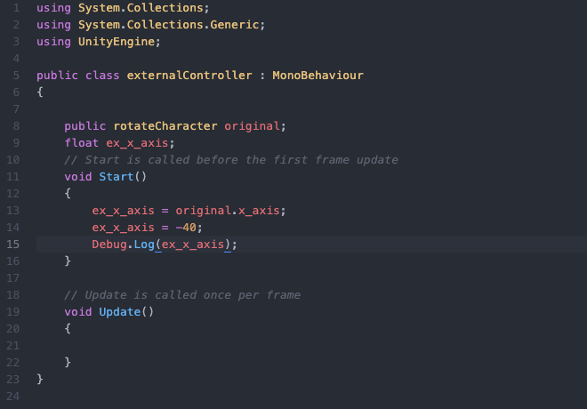
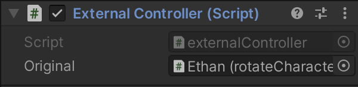
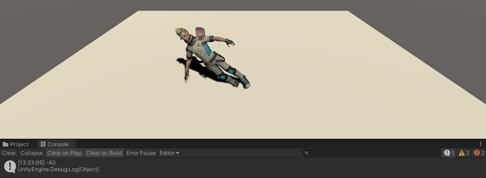

# Underwater Final

This repository includes the Unity project to complete the final project for "Intro to HCI (CMSC 20300)." The project features a simple scuba-diving-esque scene, for which you must improve and complete the player's user interface.

## Project Functionality

### Specifications

Download and install **Unity Hub** (https://unity3d.com/get-unity/download). Then, make sure to add Unity version **2019.4.1f1** via the hub (this is a long-term support version as of 2020/11/22). Most computers should be able to handle this project without any problems.

### Navigation & Interactions

Use your mouse to orient the player and the following keys for navigation:

* w: move forward.
* a: move to the left.
* d: move to the right.
* s: move backwards.
* SPACE: jump.
* SHIFT: run.
* Left click (in Game Screen): interact with a UI button.

The keys remain the same when you go underwater, but you may have a harder time jumping due to the pressure from the water. **Special note:** when you call the emergency frequency, you're game restarts.

### Key Scripts, Game Objects, & Functions

To complete your homework, you may need to implement some UIs or simple code that interfaces with parts of the existing project. Below we provide a list of key scripts, game objects, and functions you may want to keep in mind:

* Game Objects:
  * `Player`: the player, includes the camera, arm, arm UI, and 3D UI nested under it.
  * `Pedro`, `Romain`, `Suzie`: your crewmates! (But you shouldn't be accessing their game objects directly!)
  * `Information Manager`: this is the game object that holds the `InformationManager` script, from which you can get key info about things like oxygen or battery levels.
  * `Call Tower Manager`: this is the game object that holds the `CallTowerManager` script, from which you can get key info like crewmate names, coordinates, and frequencies.
  * `HUD Flat UI`: this is the canvas with flat HUD interfaces, like the oxygen bar made in class.
  * `Goggles (UI)`: this is the game object with the objects that form the 3D HUD interfaces, like the compass.
  * `Arm UI`: this is the canvas with the UI anchored on the player's arm.
* Scripts:
  * `InformationManager` script functions of interest:
    * `float GetDepth()` returns the user's current depth.
    * `int GetBatteryLevel()` returns the current battery level. This value does not replenish!
    * `int GetOxygenLevel()` returns the current oxygen level. This value replenishes out of water.
    * `int GetMaxOxygenLevel()` returns the maximum oxygen level.
  * `CallTowerManager` script functions of interest:
    * `CrewInfo[] GetCrewmatesInformation()` returns a `CrewInfo[]` array of crewmate information, including name, position, and call frequency. See `CrewInfo` for the struct.
    * `int GetFrequencyMin()` returns the minimum frequency for crewmate calls.
    * `int GetFrequencyMax()` returns the maximum frequency for crewmate calls.
    * `int GetEmergencyFrequency()` returns the emergency frequency number, which is unique and outside of the regular frequency range.
    * `AudioClip CallCrewmate(int frequency)`  returns the appropriate audio clip based on the frequency you gave the function.
  * `SimpleDial` script (on the `Forearm`) functions of interest:
    * `void QuickDial(int freq)` attempts to make a call to the given frequency if you are not currently busy with an incoming call or in a call (or forgot to hang up!).
    * `void AnswerCall()` attempts to answer an incoming call if there is currently one occurring.
    * `void HangUp()` attempts to hang up if you are currently busy (incoming call, in a call, or forgot to hang up).
* Scenes (in the `Scenes` folder!):
  * `Underwater`: the main game scene.
  * `GameOverBattery`: game over screen when your battery runs out.
  * `GameOverOxygen`: alternative game over screen when your oxygen runs out.

## Homework

Check the homework instructions in the class wiki. 

## Learning Unity

### Unity intro sequence

We highly recommend you start by completing this tutorial: https://docs.unity3d.com/ScriptReference/

### Private vs. public variable

You need to know there are two different types of variables in Unity: private and public variables.
  
We will explain this with a simple example you see in the below.

There is a character (Ethan) standing on a plain.
Here, we try to rotate Ethan with a simple script, "rotateCharacter" attached to Ethan.

### Unity3D API and reference (always search here to see what functions are available, do, etc)

https://docs.unity3d.com/ScriptReference/

