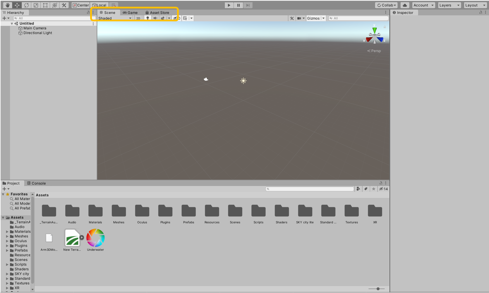
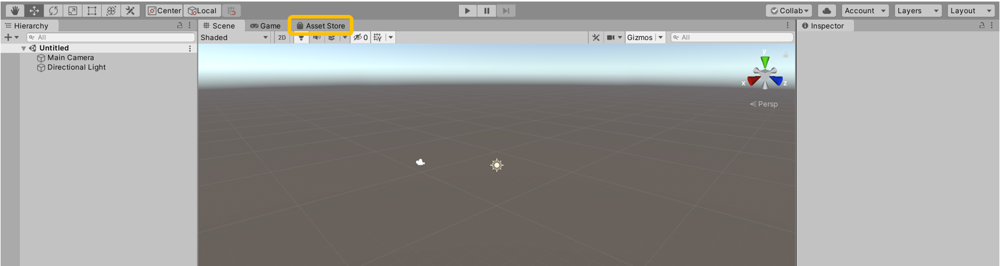

# Underwater Final

This repository includes the Unity project to complete the final project for "Intro to HCI (CMSC 20300)." The project features a simple scuba-diving-esque scene, for which you must improve and complete the player's user interface.

## Project Functionality

### Specifications

Download and install **Unity Hub** (https://unity3d.com/get-unity/download). Then, make sure to add Unity version **2019.4.1f1** via the hub (this is a long-term support version as of 2020/11/22). Most computers should be able to handle this project without any problems.

### Navigation & Interactions

Use your mouse to orient the player and the following keys for navigation:

* w: move forward.
* a: move to the left.
* d: move to the right.
* s: move backwards.
* SPACE: jump.
* SHIFT: run.
* Left click (in Game Screen): interact with a UI button.

The keys remain the same when you go underwater, but you may have a harder time jumping due to the pressure from the water. **Special note:** when you call the emergency frequency, you're game restarts.

### Key Scripts, Game Objects, & Functions

To complete your homework, you may need to implement some UIs or simple code that interfaces with parts of the existing project. Below we provide a list of key scripts, game objects, and functions you may want to keep in mind:

* Game Objects:
  * `Player`: the player, includes the camera, arm, arm UI, and 3D UI nested under it.
  * `Pedro`, `Romain`, `Suzie`: your crewmates! (But you shouldn't be accessing their game objects directly!)
  * `Information Manager`: this is the game object that holds the `InformationManager` script, from which you can get key info about things like oxygen or battery levels.
  * `Call Tower Manager`: this is the game object that holds the `CallTowerManager` script, from which you can get key info like crewmate names, coordinates, and frequencies.
  * `HUD Flat UI`: this is the canvas with flat HUD interfaces, like the oxygen bar made in class.
  * `Goggles (UI)`: this is the game object with the objects that form the 3D HUD interfaces, like the compass.
  * `Arm UI`: this is the canvas with the UI anchored on the player's arm.
* Scripts:
  * `InformationManager` script functions of interest:
    * `float GetDepth()` returns the user's current depth.
    * `int GetBatteryLevel()` returns the current battery level. This value does not replenish!
    * `int GetOxygenLevel()` returns the current oxygen level. This value replenishes out of water.
    * `int GetMaxOxygenLevel()` returns the maximum oxygen level.
  * `CallTowerManager` script functions of interest:
    * `CrewInfo[] GetCrewmatesInformation()` returns a `CrewInfo[]` array of crewmate information, including name, position, and call frequency. See `CrewInfo` for the struct.
    * `int GetFrequencyMin()` returns the minimum frequency for crewmate calls.
    * `int GetFrequencyMax()` returns the maximum frequency for crewmate calls.
    * `int GetEmergencyFrequency()` returns the emergency frequency number, which is unique and outside of the regular frequency range.
    * `AudioClip CallCrewmate(int frequency)`  returns the appropriate audio clip based on the frequency you gave the function.
  * `SimpleDial` script (on the `Forearm`) functions of interest:
    * `void QuickDial(int freq)` attempts to make a call to the given frequency if you are not currently busy with an incoming call or in a call (or forgot to hang up!).
    * `void AnswerCall()` attempts to answer an incoming call if there is currently one occurring.
    * `void HangUp()` attempts to hang up if you are currently busy (incoming call, in a call, or forgot to hang up).
* Scenes (in the `Scenes` folder!):
  * `Underwater`: the main game scene.
  * `GameOverBattery`: game over screen when your battery runs out.
  * `GameOverOxygen`: alternative game over screen when your oxygen runs out.

## Homework

Check the homework instructions in the class wiki. 

## Learning Unity

### Unity intro sequence

We highly recommend you start by completing this tutorial: https://docs.unity3d.com/ScriptReference/

### Unity's interface

Here for more source and more details: https://docs.unity3d.com/Manual/UsingTheEditor.html

* **(A)** [The Toolbar](https://docs.unity3d.com/Manual/Toolbar.html) provides access to the most essential working features. On the left it contains the basic tools for manipulating the **Scene view** and the **GameObjects** within it. In the centre are the play, pause and step controls. To run the application, press the play button. The game view (C) should now be running the game and the play button should turn blue. 

You can either pause the game or stop your game by pressing the play button again. Note that all the new changes made after running the game will only be applied on the next instance. Inspector (E) values change during the gameplay will also reset once you stop the game. 
* **(B)** [The Hierarchy window](https://docs.unity3d.com/Manual/Hierarchy.html) is a hierarchical text representation of every GameObject (objects in your game) in the **Scene**. Each item in the **Scene** has an entry in the hierarchy, so the two windows are inherently linked. The hierarchy reveals the structure of how GameObjects attach to each another following a parent-child structure. Children's reference (i.e. coordinates) are based on the parent's unless specified, and the root parent to the world's.
* **(C)** [The Game view](https://docs.unity3d.com/Manual/GameView.html) simulates what your final rendered game will look like through your Scene **Cameras**. When you click the Play button, the simulation begins.
* **(D)** [The Scene view](https://docs.unity3d.com/Manual/UsingTheSceneView.html) allows you to visually navigate and edit your Scene. The Scene view can show a 3D or 2D perspective, depending on the type of Project you are working on. If you can't see the scene window, you can find it in a tab on the central window next to the Game view.

* **(E)** [The Inspector Window](https://docs.unity3d.com/Manual/UsingTheInspector.html) allows you to view and edit all the properties of the currently selected GameObject. Because different types of GameObjects have different sets of properties, the layout and contents of the **Inspector** window change each time you select a different GameObject. Please refer to the later section about how to display variables in the inspector.
* **(F)** [The Project window](https://docs.unity3d.com/Manual/ProjectView.html) displays your library of Assets (scripts, 3D files, shaders, etc...) that are available to use in your Project. When you import Assets into your Project, they appear here.

You can also visit the Asset Store if you wish to add premade 3D elements, scripts etc... to your project. Please only use free assets and delete all unused ones to avoid having a large project file.

### Private vs. public variable

You need to know there are two different types of variables in Unity: private and public variables.

We will explain this with a simple example you see in the below.

There is a character (Ethan) standing on a plain.  
Here, we try to rotate Ethan with a simple script, "Rotate Character" attached to Ethan.

Inside the script, we define two variables: 'x_axis' and 'y_axis', which respectively control the rotation of Ethan around x and y axes.  
Importantly, we define 'x_axis' as a public float while 'y_axis' as a private float.  
And we only dectate the value (-90) of 'y_axis' in the script.  
Let's see how this script turns out to be...

Then, when you go back to the inspector, now you can see the variable, 'x_axis' which you can directly manipulate on the inspector.  
Whereas, we never see anything regarding 'y_axis' on the inspector.

This is the fundamental difference between private and public variables you should know at this moment.  
If you want to make your variable accessible from outside of a specific script, you have to define it as a public variable.  
When you do not put any prefix (i.e., private or public) to your variables, Unity automatically regard them as private variables which you can only make change on them through the original script.  

Now, we've set the value of 'x_axis' to 40 on the inspector.  
Let's see the result by playing the scene.   

As you can see, Ethan is now facing to the view (because of 'y_axis') and tilted (because of 'x_axis').

Further, public variables can be referred by external scripts.  
We show this with the following example.

Now, let's create additional (empty) game object called 'External Controller' and attach a new script titled 'externalController'.

In this script, we define another public variable, 'original' in which we can call the public variable, 'x_axis'.  
And, we try to read the value of 'x_axis' and show it on the console.

Make sure that you assign the Ethan object to the public variable, 'original' on the inspector.

As you can see, now we could successfully read the value of the public variable from the external script.  
By editing 'externalController', you can also manipulate 'x_axis'.

### Unity3D API and reference (always search here to see what functions are available, do, etc)

https://docs.unity3d.com/ScriptReference/

